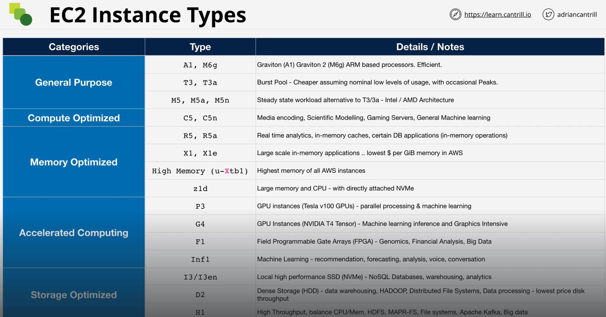

# Virtualization

- EC2 provides virtualization as a service (IaaS).

- Virtualization is the process of running **more than one Operating System (O/S) on a single piece of physical hardware.**

- An O/S must interact with physical hardware such as CPU, Memory, Network and I/O Devices.

- The part of the O/S that can interact with the system's hardware is called the *kernel*, which runs in what's called *privileged mode*

- Applications run in *user mode* (or un-privileged mode). They cannot interact with hardware.
  - An application has to make a *system call* to the kernel to interact with hardware. It cannot directly interact with the hardware.
  - If anything but the O/S attempts to make a privileged call, the system will detect and cause a system-wide error, generally crashing the system (or at min the app)

- A CPU can only have one thing running as privileged. If multiple O/S try to run in one hardware with their own set of applications, they will conflict and crash.
  - Virtualization seeks to solve exactly the problem of having these multiple O/S running on a single bit of hardware.

## Emulated Virtualization (Software Virtualization)

- Host operating system ran on the hardware in privileged mode(with additional capability called *hypervisor*)
  - The guest operating systems ran on top of the host inside a container called a *Virtual Machine* (VM)
  - Each *Virtual Machine* is an unmodified O/S with a virtual allocation of physical resources

- Guest O/S believed that the emulated hardware provided by hypervisors were actually real and running on real hardware, making *privileged* calls
  - Without special arrangements the system would crash or overwrite each other memories

- In other to avoid this problem the hypervisor does *binary translation* which translates any *privileged* operations on the fly in software by the hypervisor
  - This means guest O/S need no modification...
  - ...but they are **REALLY slow** (50% or more)

## Para-Virtualization

- Para-Virtualization means the O/S's are running in virtual machines containers with virtual resources

- However, instead of directly translating every single instruction, they modify the guest O/S's so that it is emulation aware:
  - Non-privileged (user-level) instructions are now directly executed by the hardware!
  - But privileged calls are replaced with *hypercalls* and trapped by the hypervisor.

- The main disadvantage is that this requires O/S modification. Closed systems such as Windows don't support this.

- It is still a set of software processes designed to trick the O/S or Hardware that nothing had changed

## Hardware Assisted Virtualization (HAV)

- The major improvement to virtualization as it made the physical hardware itself became **virtualization aware.**

- The CPU knows that virtualization exists and contains specific instructions and capabilities so that the hypervisor can directly control and configure its support

- Privileged instructions are now trapped by the CPU and the system does not halt
  - The instructions can't be executed "as is" so they are redirected to the hypervisor by the hardware
  - The hypervisor then handles how they are executed

- With HAV there's very little performance degradation and it does not require O/S modification, just that the hardware (CPU) supports this.

## SR-IOV

- Even though HAV helps a lot, what actually tends to matter for a VM is Input/Output (I/O) operations like network transfer and disk I/O

- The VMs have what they think is physical hardware, but they all connect to an actual single piece of hardware like a network card, which sits on the Host.
  - Unless you have a single physical network card per VM there's always some level of software getting in the way and this impacts performance.

- **Single-root IO Virtualization (SR-IOV)** allows a network card or add-on card to present itself as several *mini cards*. This splits a physical card into several logical cards to present to guest O/S's.

- SR-IOV is a method of device virtualization that provides higher I/O performance and lower CPU utilization when compared to traditional virtualized network interfaces.

- In EC2 this feature is called **Enhanced Networking**
  - Enhanced networking provides higher speeds, lower latencies and consistent lower latency even at high I/O loads
  - SR-IOV enables network traffic to bypass the software switch layer of the Hyper-V virtualization stack.
  - There is no additional charge for using enhanced networking.

### Virtualization Resources

http://www.brendangregg.com/blog/2017-11-29/aws-ec2-virtualization-2017.html

# EC2 Architecture and Resilience

- EC2 instances are **Virtual Machines**(VMs)
  - VMs = O/S + Resources

- EC2 instances run on **EC2 Hosts** physical service hardware managed by AWS, which are either:
  - *SHARED* Hosts by default (same hardware is shared across different AWS customers, but every customer is *isolated* from each other and you pay for instance on it); or
  - *DEDICATED* Hosts (entire hardware is yours, you don't have to share with others)

- [EXAM]: EC2 is a **AZ resilient service**.
  - **Hosts run inside a single AZ.**
  - If AZ fails -> EC2 Hosts inside fails -> EC2 Instances fails

## EC2 Architecture

- EC2 hosts have some local hardware:
 - CPU
 - Memory (RAM)
 - Temporary local storage called *Instance Store*
  - If the EC2 instance moves to another EC2 Host this storage is lost
 - Two types of networking:
  1. Data Network
    - When instances are provisioned into a specific subnet within a VPC, a primary *Elastic Network Interface (ENI)* is provisioned in a subnet which maps to the physical hardware (Data Networking) on the EC2 host.
    - Instances can have multiple ENIs even in different subnets, *as long as they are in the same AZ!*
  2. Storage
    - EC2 Host can connect to *Elastic Block Store*(EBS), a network based storage.
      - EBS is also *AZ Resilient*.
      - EBS services run inside an AZ and you can't access them cross zone.
      - EBS lets you allocate **volumes**, or portions of persistent storage, and these can be allocated to instances only in the same AZ.

- An Instance runs on a specific host. If you restart the instance, it will stay on that host.
  - An instance will only change a host if:
    1. The host fails or is taken down for maintenance by AWS
    2. An instance is STOPPED and then STARTED (different than just restarting)
  - In any case, instances will also be in the same AZ. Instances can't migrate automatically between AZs.

- Migrations between AZs are 'possible', but it's essentially copying an instance into a new AZ (using snapshots and AMIs)

- Instances runnings on an EC2 Host share the host's resources.
  - You can have instances of different sizes sharing a host, but the general rule is that instances of same type/generation will share a EC2 Host.
  - Think that a EC2 Host is from a certain year and has a generation (certain type of CPU, memory and storage)

[EXAM]: An EC2 Host runs within a SINGLE AZ. They are AZ Resilient.
[EXAM]: EC2 Instances run on an EC2 Host and thus are locked inside one specific AZ. Same with EBS volumes.

## What's EC2 Good For?

- Traditional **O/S and Application** Compute
- **Long-Running** Compute (24/7/365)
- **Server** style application (traditional apps running in an O/S, awaiting incoming connections)
- Great for occasional **bursts** *or* **steady state** load requirements
- **Monolithic** application stacks
- **Migrated** application workloads (lift-and-shift)
- **Disaster Recovery**

- EC2 tends to be the *default* compute service within AWS.

# EC2 Instance Types

- You can select instance type/size for more granular control of resources

- Choosing a different instance type influences a few things:
  - The **raw** amount of resources you get: virtual CPU, memory, local storage capacity, and type of storage
  - **Resource Ratios** (e.g. CPU to RAM)
  - **Storage** and **Data** Network **Bandwidth**
  - The System Architecture / Vendor you have available (e.g. x86 vs. ARM, Intel vs. AMD)
  - Additional feature and capabilities such as allocation of GPUs, field programmable gate arrays (FPGAs)

### EC2 Instances - Grouped into 5 Main Categories:

- **General Purpose** (should be used as the *default*, only move away if you have specific needs): Diverse workloads, equal resource ratios

- **Compute Optimized**: Designed for media processing, high performance computing, scientific modeling, gaming, machine learning. Access to the latest high performance CPUs. Resource Ratio offers more CPU compared to memory.

- **Memory Optimized**: Inverse of Compute Optimized. Processing large in-memory datasets (Ex. in-memory caching), some database workloads

- **Accelerated Computing**: Dedicated Hardware GPUs for high scale parallel processing and modeling. Custom programmable hardware known as field programmable gate arrays (*FGPAs*). Accelerated Computing category is often for niche requirements - you'll know when you need this category.

- **Storage Optimized**: Large amounts of super fast, local storage. High sequential transfer rates or massive amounts of I/O operations per second. Scale out transactional databases, data warehousing, Elasticsearch, analytics workloads. The Storage Optimized category is great for applications that have serious demands on sequential and random I/O.

### EC2 Instance Types: Decoding the naming scheme

Ex. R5dn.8xlarge. <- Example of type of EC2 instance

- This is known as an Instance Type. If a operations team member asks what instance type we need? You provide this full name.
  - Start letter, R, is the INSTANCE FAMILY
  - 2nd character, 5, is the INSTANCE GENERATION. For example, a C4 would be the 4th generation of the C family of instance.
    - Always select the most recent gen.
    - Only if it is not available on your region or if you have strict testing requirements to update you should stay on an older gen.
  - "dn" can vary
    - This collection of letters between family-generation and size may not always be present.
    - These letters denote additional capabilities (e.g. 'a' signifies AMD CPUs, 'n' is network optimized, 'e' is extra capacity for RAM or storage and so on).
    - Some examples:
      - 'c' stands for computer. Compute Optimized
      - 'r' stands for RAM. Memory Optimized
      - 'I' stands for I/O. Storage Optimized
      - 'D' Dense Storage. Storage Optimized
      - 'G' GPU. Accelerated Computing
      - 'P' Parallel Processing. Accelerated Computing
    - You don't need to memorize these extra capabilities for the exam.
  - "8xlarge" is the size of the instance. Sizes: nano, micro, small, medium, large, xl, 2xl, 4xl, 8xl, and so on...
    - There's a price premium on the higher end of instance sizes
    - It's often better to scale horizontally the system with large number of small sizes

### EC2 Instance Type Resources

- https://aws.amazon.com/ec2/instance-types/
- https://ec2instances.info/
- Table / Visual of Instance Categories/Types/Details and Notes:

## [DEMO] EC2 SSH vs EC2 Instance Connect

Amazon EC2 Instance Connect provides a simple and secure way to connect to your Linux instances using Secure Shell (SSH). With EC2 Instance Connect, you use AWS Identity and Access Management (IAM) policies and principals to control SSH access to your instances, removing the need to share and manage SSH keys.

1. Make keypair for SSH: EC2 > Key Pairs, Create key pair > since we already have 'A4L' kp, we're good
2. 1-Click Deploy: Click 1-Click Deploy lesson link > Create Stack, Acknowledge, Create stack
3. Connect to Instance via SSH: EC2 > Instances > A4L, Connect, SSH Client > Open your Terminal > cd to directory with Key Pair .pem file > Paste command, Enter, 'Yes' for fingerprint
4. Connect with EC2 Instance Connect:  EC2 > Instances > A4L, Connect, EC2 Instance Connect
  - NOTE: EC2 Instance Connect is not originating connections through your machine (not your IP)
  - Use [this list](https://ip-ranges.amazonaws.com/ip-ranges.json) to get the IP that matches the AWS Region of your EC2 Instance and has service as EC2_INSTANCE_CONNECT. Allow it on your Security Group
5. Clean up > CFN > Delete Stack

## Storage Refresher
### Key Terms:
- DIRECT (local) attached storage: Storage on the EC2 Host
- NETWORK attached storage: Volumes are created and attached to a device over the network. In AWS, uses EBS (Elastic Block Store). Highly resilient, separate from instance hardware
- EPHEMERAL storage: Temporary storage, non-persistent. This is the Instance Store, physical storage attached to an EC2 Host
- PERSISTENT storage: Permanent storage that lives past the lifetime of an instance.
EXAM: An example of Persistent Storage in AWS is the networked attached storage delivered by EBS. Know which types of storage are Ephemeral and Persistent

### Categories of Storage:
- BLOCK storage: Create a Volume (Ex. inside EBS) that is presented to the OS as a collection of blocks; NO STRUCTURE beyond that. Mountable. Bootable.
- FILE storage: Presented as a file share/file server WITH STRUCTURE. Mountable. NOT bootable.
- OBJECT Storage: Collection of objects. NO STRUCTURE; flat. NOT mountable. NOT bootable.

### Storage Performance
These items don't exist in isolation. IOPS is like speed of engine a racecar runs at (revolutions per second), IO block size is like the size of the car's wheels, throughput is the top-speed of the racecar.
- IO BLOCK SIZE: Size of the data you're writing to disk.
- IOPS: Measures the number of I/O operations a storage system supports in a second (how many read/writes in a second)
- THROUGHPUT: Amount of data that can be transferred in a given second, MB/s.
* IO x IOPS = Throughput
** Ex. 16KB IO block size x 100IOPS = 1.6MB/s throughput

## EC2 - EBS Service Architecture
Amazon Elastic Block Store (Amazon EBS) provides block level storage volumes for use with EC2 instances. EBS volumes behave like raw, unformatted block devices. You can mount these volumes as devices on your instances. EBS volumes that are attached to an instance are exposed as storage volumes that persist independently from the life of the instance. You can create a file system on top of these volumes, or use them in any way you would use a block device (such as a hard drive).
- EBS can be encrypted using KMS
- When you attach a volume to an EC2 instance, the instance sees a Block Device, so raw storage.
- EBS volumes appear just like any other storage device to an EC2 instance
- EBS Volumes are attached to ONE instance at a time. However, can be detached and re-attached to a new instance. They are not lifecycle linked to one instance, they're persistent; if an instance moves to a new EC2 host, the volume follows it. EBS is persistent until you delete the volume (separate from the instance)
- Snapshot into S3: You can create a backup of a volume with a Snapshot into S3. This can be used to migrate volumes between AZs.
- EBS can provision volumes based on different physical storage types: SSD, high-performance SSD, volumes based on mechanical disks, different size volumes, different performance profiles
- BILLING: Gigabyte/Month metric (and in some cases, performance)

EXAM: Storage is provisioned in ONE AVAILABILITY ZONE; Resilient in that AZ
EXAM: Snapshots are now REGIONALLY RESILIENT

### EBS Example - 1 region, 2 AZs (AZA, AZB), 1 S3 bucket.
EBS is AZ-based. So, with two AZs you have two separate EBSs. Same as EC2 hosts--per AZ
- EBS replicated data within an AZ. Failure of an entire AZ means failure of all volumes in that AZ. To fight this, you can Snapshot volumes into S3, creating more resilience, and you can create another volume in a new AZ from this snapshot (or even to a new region)
- For Global Resilience on volumes, copy snapshots over to different regions

## EC2 - EBS Volume Types
General Purpose SSD — Provides a balance of price and performance. We recommend these volumes for most workloads.
- Volumes can very in size from 1GB -> 16TB
- When created, a volume is given an I/O credit allocation

### EBS Volume Types - General Purpose (GP):
1. GP2. GP2 is the default general purpose SSD based storage provided by EBS. CREDIT ARCHITECTURE
- GP2 gets 3 IO credits per second, per GB of volume size
- "Burst Rate": GP2 volume can burst up to 3,000 IOPS
- Max IOPS for GP2 is currently 16,000 IO credits per second (baseline performance) - Any volumes > 5.33TB in size achieves this rate constantly
- Great for: boot volumes, low latency interactive apps, dev/test environments
- GP2 auto scales on size

2. GP3. SSD based, but removed the credit architecture GP2
- Every GP3 volume, regardless of size starts with 3,000 IOPS and 125MiB/s
- ~20% cheaper than GP2
- Need more performance? Can pay for up 1o 16,000 IOPS or 1,000 MiB/s
- GP3 does NOT auto-scale, you have to enable the upgrades

#### IO Credit. When you create a volume (size ranging from 1GB -> 16TB), it is created with an IO credit allocation.
- An IO is one input/output operation
- IO credit is a 16KB chuck of data
- An IOP is one chuck of 16KB in one second
- Ex. If transferring a 160KB file, that's 10 IO blocks of data. If this is all done in 1 second, that's 10IOPS. (IO x IOPS = Throughput -> 10 x 1 = 10IOPS)
- 1 IOPS is 1 IO in 1 second
- IF you have NO credits in your IO "bucket" in the volume, you can't perform any IO on the disc
- IO Bucket has capacity of 5.4 million IO credits and "Fills at the rate of Baseline Performance"
- "Fills at the rate of Baseline Performance"... what does this mean? Every volume has baseline performance based on size, with a minimum
-- IO Bucket bills with minimum of 100 IO Credits per second REGARDLESS OF VOLUME SIZE

## EC2 - EBS Volume Types - Provisioned IOPS (io1, io2, io2 Block Express)
Provisioned IOPS SSD — Provides high performance for mission-critical, low-latency, or high-throughput workloads.
- Three types of provisioned IOPs SSD: io1, io2, io2 Block Express
- IOPS are configurable independent of volume size and designed for super high-performance situations
- Max 64,000 IOPS/volume
- io1/io2, 1,000MB/s throughput
- io2 Block Express: 256,000 IOPS, 4,000MB/s throughput
- Size: 4BG -> 16TB for io1/io2. io2 Block Express 4GB -> 64TB
- Size-to-performance ratio maximums: io1 50IOPS/GB, io2 500IOPS/GB, io2 Block Express 1000IOPS/GB
- Per Instance Performance restriction: the max performance between the EBS svc and an EC2 instance
- NUMBERS (all the specs for Provisioned IOPS): https://imgur.com/a/zYQk7G1

EXAM: Provisioned IOPS: Most consistent low latency and jitter.
EXAM: Prov.IOPS for sub-millisecond latency, consistent latency, and higher performance.

### EC2 - EBS Volume Types - HDD-Based*
* Slower, only for specific situations
Types:
1. Throughput Optimized HDD (st1) — A low-cost HDD designed for frequently accessed, throughput-intensive workloads. For sequentially accessed data like streaming
-- Big data, data warehouses, log processing
2. Cold HDD (sc1) — The lowest-cost HDD design for less frequently accessed workloads.
-- geared for max economy (lowest EBS cost option) with lowest performance

HDD Based EBS Volume Type METRICS: https://imgur.com/a/EcGVrx8

## EC2 - Instance Store Volumes - Architecture
An instance store provides TEMPORARY block-level storage devices for your instance. This storage is located on disks that are physically attached to the host computer. Instance store is ideal for TEMPORARY storage of information that changes frequently, such as buffers, caches, scratch data, and other temporary content, or for data that is replicated across a fleet of instances, such as a load-balanced pool of web servers.

An instance store consists of one or more instance store volumes exposed as block devices. The size of an instance store as well as the number of devices available varies by instance type.

The virtual devices for instance store volumes are `ephemeral[0-23]`. Instance types that support one instance store volume have ephemeral0. Instance types that support two instance store volumes have `ephemeral0` and `ephemeral1`, and so on.

- ISV = HIGHEST STORAGE PERFORMANCE in AWS
- Physically connected to ONE EC2 host - isolated to host
- If instance moves between host, data that was stored on attached ephemeral[X] is lost and instance is re-attached to new ephemeral[X]
- Instance Store Volumes should NOT be used for anything the requires persistence
- More IOPS and Throughput VS EBS

EXAM: Local to an EC2 Host
EXAM: Data stored on Instance Store Volumes is lost on instance MOVE, RESIZE, or HARDWARE FAILURE
EXAM: HIGHEST STORAGE PERFORMANCE storage option in AWS, but can't provide persistence. TEMPORARY, for replaceable data
EXAM: Instance Store Volumes have to be ATTACHED AT LAUNCH OF INSTANCE, cannot happen after. Instances on this host only can access them

## Choosing between the EC2 Instance Store Volumes (ISV) and EBS
Resource: https://aws.amazon.com/ec2/instance-types/

Need...
Persistence? EBS (avoid ISV)
Resilience? EBS (avoid ISV)
Isolated from Instance Life Cycles? (to be able to un-attach and re-attach) EBS (avoid ISV)
Resilience w/App In-Built Replication... it depends
High Performance? Depends (ISV is super high performance)
Cost is main factor? ISV (it's often included in the price)

REMEMBER ALL OF THIS:
EXAM: Cost Efficacy? ISV ST1 or ISV SC1. For throughput + streaming? ST1
EXAM: Boot EC2 instances? NOT st1 or sc1
EXAM: GP2 / GP3: Has a max performance of 16,000 IOPS
EXAM: IO1 / IO2: Has max 64,000 IOPS (256,000 IOPS in io2 Block Express) - Max EBS performance with large instance (that is capable of providing this performance)
EXAM: RAID0 + EBS: Has max 260,000 IOPS
EXAM: Need anything greater than 260,000 IOPS? use ISV, not EBS. *No persistence
EXAM: EBS Automated Backups? Amazon Data Lifecycle Manager: To automate the creation, retention, and deletion of Amazon EBS snapshots

TL;DR EBS Volume VS Instance Store
- EBS volume is network attached drive which results in slow performance but data is persistent meaning even if you reboot the instance data will be there.
- Instance store instance store provides temporary block-level storage for your instance. This storage is located on disks that are physically attached to the host computer.
-- Data on an instance store volume persists only during the life of the associated instance; if an instance is stopped or terminated, any data on instance store volumes is lost.

SSD: General Purpose (gp2, gp3), Provisioned IOPS SSD volumes (io1, io2, io2 Block Express)
HDD: st1, sc1

## EC2 - EBS Snapshots, Restore & Fast Snapshot Restore (FSR)
- EBS Snapshots are backups of data consumed within EBS Volumes - Stored on S3.
- Snapshots are incremental, the FIRST COPY being a full backup - and any future snapshots being incremental. No massive risk of losing incremental backups (each increment is self-sufficient)
- Snapshots can be used to migrate data to different availability zones in a region, or to different regions of AWS.
- AZ Resilient (vulnerable to issues which impact entire AZ), but with a snapshot the data becomes Region Resilient
- Good for EBS Volume cloning, even moving / copying them across AZs
- BILLING: Gigabyte-month cost; but you're only paying for USED data, not allocated data

EXAM: Snapshot doesn't need to be initialized in a new EBS Volume, it's built-in
EXAM: Snapshots are restored LAZILY; fetched gradually
EXAM: Requested blocks are fetched immediately, you can do this initially to force rapid initialization so users have quickest access up front
EXAM: Fast Snapshot Restore (FSR): A setting to Enable that allows immediate restores instead of gradual
EXAM: Up to 50 FSRs per region. Set on the Snap & AZ, so 50 between AZs
EXAM: FSR costs extra

## DEMO - EC2 -  EBS Volumes
Commands for Terminal: https://learn-cantrill-labs.s3.amazonaws.com/awscoursedemos/0004-aws-associate-ec2-ebs-demo/lesson_commands.txt
1. Create an EBS Volume: 1-Click Deploy link > Create Stack > EC2 EBS > Create Volume > select GP2, 10 GiB size, AZ us-east-1a, tag: kay "Name" value "EBSTestVolume" > Create
2. Mount it to an EC2 instance: Select new EBS Volume > Actions: Attach Volume > Choose Instance1 > Attach
3. Create and Mount a file system: Ec2 Instance > select A4L-EBS-INSTANCE1-AZB, Connect > EC2 Instance Connect > `sudo mkfs -t xfs /dev/xvdf`, Enter
4. Generate a test file: EC2 Connect > `sudo mkdir /ebstest`, Enter > Mount dev/xvdf to /ebstest directory `sudo mount /dev/xvdf /ebstest` > cd /esbstest > `sudo nano amazingtestfile.txt` > write text, ctrol+o, enter, ctrl+x > Reboot instance `sudo reboot`
5. Migrate volume with Snapshot: EC2 > Instances > Stop AZA Instance 1 and 2 > when stopped, Volumes: Detach Volume > right click EBS Volume, Create Snapshot > Right click Snapshot, Create Volume from Snapshot > Zone us-east-1b > Tag key "Name" value "EBSTestVolume-AZB" > Create
6. Attach Volume to AZB instance: Volume > right click, Attach > ABZ Instance 1 > ATtach
7. Verify the filesystem and file are intact > EC2 Instance Connet on AZB Instance 1 > `lsblk` > `sudo mkdir /ebstest` > `sudo mount /dev/xvdf /ebstest`
8. Stop AZB Instance > Detach EBS Volume
9. Clean up > Detele Snapshopt > Volumes: delete test volumes > CloudFormation: Delete Stack
* The remaining DEMO is not FREE TIER
* On Instance Store Volumes, Instance reboot does not cause the data to be lost or moving to new host, but a Stop/Start changes hosts and you lose data

## EC2 - EBS Encryption
EBS Encryption provides AT REST encryption for volumes and snapshots.
- Uses KMS: AWS/EBS Keys or Customer Managed Keys
- Uses DEK

EXAM: AWS Accounts can be set to encrypt by default - Default KMS Key
EXAM: Each Volume uses ONE unique DEK. Snapshots and future volumes use the SAME DEK. Volume from scratch? New DEK
EXAM: There is NO WAY To remove an encryption from a volume, unless you clone data to a new volume
EXAM: O/S is not aware of the encryption (no performance loss)

## EC2 - Networks Interfaces, Instance IPs and DNS
Elastic Network Interfaces (ENIs) which can be allocated to EC2 instances - and the DNS, public, private and elastic IPs which can be assigned to those ENIs
- Each EC2 Instance starts with one ENI (primary ENI). You can attach more ENI's, but to different subnets
- Lots of things are attached to ENIs and not instances: Security groups, lots of IP stuff, Source/Destination checks
- You can detach secondary ENIs and move them to different instances
- ENIs contain...
-- Primary Private IPv4 address
-- Secondary Private IPv4 address
-- Optionally, 1 public IPv4 address
-- Optionally, 1 or more Elastic IP addresses

### EC2 - Elastic IP address
Allocated to your AWS account. If Elastic IP assigned, it removes the Public IPv4 and replaces with the Elastic IP

EXAM: If you assign Elastic IP and remove it, can you get the original, replaced IPv4 address back? NO, you get a different one back
EXAM: Secondary ENIs + MAC addresses = Licensing that can move between instances
EXAM: Multi-homed (subnets) Management & Data: An instance with an ENI in two different subnets (maybe use one for management and one for data)
EXAM: Security Groups are attached to ENIs, not instances. Different rules needed for different groups? Set up multiple ENIs with SGs on each
EXAM: THE OPERATING SYSTEM NEVER SEES THE PUBLIC IPv4; it's configured on the ENI
EXAM: IPv4 Public IPs are DYNAMIC... Stop/Start instance means IP de-allocation/changes. Restarting instance maintains same IP. To avoid this, assign Elastic IP address
EXAM: Public DNS given to the instance for the public IPv4 IP address resolves to the PRIMARY PRIVATE IPv4 address from within the VPC. This happens so that if you've got instance-to-instance communication, it never leaves the VPC. Outside the VPC, DNS will resolve to the PUBLIC address

## DEMO - EC2 -  Manual Install of Wordpress on EC2 - NOTE-INCOMPLETE DEMO, IT BROKE
Use EC2, install MariaDB, Apache & libraries and then download and install wordpress.
- Learning how NOT to do things through a manual installation

Steps:
1. 1-Click Deployment in lesson > Wait for stack to hit CREATE COMPLETE
2. Install WP: EC2 > Instances Running > right-click A4L, Connect, Instance Connect
3. Create Variables in Console >
DBName='a4lwordpress'
DBUser='a4lwordpress'
DBPassword='4n1m4l$4L1f3'
DBRootPassword='4n1m4l$4L1f3'
> Paste each, press Enter, paste the next, Enter
4. Install system software - including Web and DB: `sudo yum install -y mariadb-server httpd wget` > install PHP/MariaDB `sudo amazon-linux-extras install -y lamp-mariadb10.2-php7.2 php7.2`
5. Web and DB Servers Online - and set to startup:
sudo systemctl enable httpd >
sudo systemctl enable mariadb >
sudo systemctl start httpd >
sudo systemctl start mariadb
6. Set Mariadb Root Password: `mysqladmin -u root password $DBRootPassword`
7. Install Wordpress: `sudo wget http://wordpress.org/latest.tar.gz -P /var/www/html` > `cd /var/www/html` > `sudo tar -zxvf latest.tar.gz` (to extract tar file) > `sudo cp -rvf wordpress/* .` (copy data from WP file to current file '.') > `sudo rm -R wordpress` > `sudo rm latest.tar.gz`
8. Configure Wordpress:
sudo cp ./wp-config-sample.php ./wp-config.php (rename template config file to be actual) >
sudo sed -i "s/'database_name_here'/'$DBName'/g" wp-config.php (search and replace to update config file >
sudo sed -i "s/'username_here'/'$DBUser'/g" wp-config.php >
sudo sed -i "s/'password_here'/'$DBPassword'/g" wp-config.php >
sudo chown apache:apache * -R (making sure web server has access to all file folders, owned by apache)
9. Create Wordpress DB:
echo "CREATE DATABASE $DBName;" >> /tmp/db.setup (create WP DB) >
echo "CREATE USER '$DBUser'@'localhost' IDENTIFIED BY '$DBPassword';" >> /tmp/db.setup >
echo "GRANT ALL ON $DBName.* TO '$DBUser'@'localhost';" >> /tmp/db.setup >
echo "FLUSH PRIVILEGES;" >> /tmp/db.setup >
mysql -u root --password=$DBRootPassword < /tmp/db.setup
sudo rm /tmp/db.setup
*** UNSUCCESSFUL DEMO--Somewhere this messed up and the system couldn't see tmp/db.setup, then it could, so the commands got duplicated -
10. Clean up Account: CFN > delete stack

## EC2 - Amazon Machine Image (AMI)
Amazon Machine Images (AMI) are the images which can create EC2 instances of a certain configuration. In addition to using AMI's to launch instances, you can customize an EC2 instance to your bespoke business requirements and then generate a template AMI which can be used to create any number of customized EC2 instances.
- AMIs are used to launch EC2 instances, even the Default EC2 instance launch is used via AMI. AMI's can be AWS or Community Provided
- Marketplace AMIs are available
- AMIs are REGIONAL... Unique ID for each AMI in each region Eg. "ami-0a887...."
- AMI controls permissions (scope: Public, Your Account, Specific Accounts)
- Not only can you create EC2 Instance from AMI, can create AMI from EC2 instance you want to template
- BILLING: billed for the storage cost... the data of the EBS snapshots contained

AMI Lifecycle:
1. Launch Instance: AMI launches EC2 instance.
2. Configure Instance: Can take launched instance and provide customizations (Eg. O/S, instance with config'd volumes, etc).
3. Create New AMI: Can create an AMI from your configured/customized Instance (make a template)
4. Launch NEW Template instance: Launch new instance with templace AMI

EXAM: AMI = ONE REGION. Only works in that region
EXAM: AMI Baking: Creating an AMI from a configured instance + application
EXAM: AMI CAN NOT be edited. Instead, launch instance, change configs, make new AMI
EXAM: AMI CAN be COPIED between regions (includes its EBS Volume Snapshots)
EXAM: Default AMI permissions: Default is your account only. (Can be private, public, or grant access to specific accounts)

## DEMO - EC2 -  Creating A4L AMI (AMI Baking)
Create WP EC2 instance. Improve EC2 login screen. Create AMI from custom instance and deploy a new instance.

Steps:
1. Set up WP Instance: https://learn-cantrill-labs.s3.amazonaws.com/awscoursedemos/0007-aws-associate-ec2-ami-demo/lesson_commands.txt > Create Stack
***UNSUCCESSFUL DEMO: Failed to complete. Cantrill says it works but I couldn't get it

## EC2 Purchase Options (Launch Types)
ON-DEMAND: Default/Shared. Per second billing. Resources like consume capacity bill regardless of instance state. Price defined up front, no discounts
-- Suitable for short term workloads, or unknown workloads

SPOT: Spot pricing is AWS selling unused EC2 Host Capacity for up to 90% discount. Spot price based on the space capacity at a given time
-- Customer sets max price they're willing to pay. If a Spot price exceeds your max willing payment, you'll lose the Spot
-- NEVER use a Spot for workloads which can't tolerate interruptions
-- Best for things that are non-time critical. Anything which can tolerate interruption and just be rerun. Anything that has a bursty capacity need.

RESERVED: Form a part of most larger deployments in AWS. For long-term, consistent usage of EC2. Purchase a reservation to remove/reduce the per second price.
-- An unused reservation is still billed. Can be locked to AZ or region. Partial coverage of a larger instance, not billed for full thing.
-- Reservations terms: 1 year or 3 years. You pay for the entire term up front (no per/s fee, greatest discount of all reserved options). Or Partial Upfront, or No-Upfront (per/s fee)
-- For when you need lowest cost, consistent usage, and can't tolerate any interruption

DEDICATED INSTANCES: Instances run on an EC2 host that you don't own or share. Extra charges for instances, but dedicated hardware
-- Fees: 1 off hourly fee for any regions using dedicated instances. Fee for the instances themselves
-- For when you can't share infrastructure

DEDICATED HOST: EC2 host allocated to you in its entirety. You need to manage capacity, however, and unused capacity is wasted.
-- 'Host Affinity' links instances to hosts
-- For Strict Licensing requirements. Reason to use this purchase option: For socket and core licensing requirements
-- You pay for the HOST, no instance charges.

EXAM: On demand, reserved, spot

## EC2 - Reserved Instances - The Rest
Scheduled Reserved Instances, the differences between zonal and regional reservations and on-demand capacity Reservations. For if you need access to the cheapest EC2 that runs 24/7/365.

### Scheduled Reserved Instances: For long term useage which doesn't run constantly. Eg. Batch processing running daily for 5 hours. Eg 2 weekly data, like every friday for 24 hours
- DOES NOT support all instance types
- 1,200 hours min per year (100 hours per month)
- 1 year minimum

### Zonal: Only applies to one Availability Zone, providing billing discounts and capacity reservation in that one AZ
- 1 or 3 year term

### Regional: Provides a billing discount for valid instances launched in any AZ in that region
- While flexible, they don't reserve capacity within an AZ, which is risky during major faults when capacity can be limited
- 1 or 3 year term

### On-Demand Capacity Reservations: Can be booked to ensure you always have access to capacity in an AZ when you need it, but at FULL ON-DEMAND price.
- NO TERM LIMITS, but you pay whether or not you use it

### Savings Plan: Kind of like a reserved instance purchase, but instead of particular type of instance, it's a 1 to 3 year commit to AWS in terms of hourly spend. Eg. Minimum spend 20$/hr for 1 or 3 years, you get a reduction in price. If you go above your savings plan ($20), you begin paying
- Can make a reservation of general compute amounts, 60% discount
- EC2 savings plan, which must be used for EC2 but 72% discount
- General Compute valid for things like EC2, fargate, lambda. These products have both on-demand rate and savings plan rate

## EC2 - Instance Status Checks & Auto Recovery
Amazon EC2 performs automated checks on every running EC2 instance to identify hardware and software issues. You can view the results of these status checks to identify specific and detectable problems.

You can create an Amazon CloudWatch alarm that monitors an Amazon EC2 instance and automatically recovers the instance if it becomes impaired due to an underlying hardware failure or a problem that requires AWS involvement to repair.
- Terminated instances cannot be recovered.
- A recovered instance is identical to the original instance, including the instance ID, private IP addresses, Elastic IP addresses, and all instance metadata

### Short Demo - When you first start an instance, these are the "2/2 checks passed"
Each of these checks is a separate set of tests.  First, system status check. Second, instance status check.
- If there's a failure, you can set Auto Recover and other actions. Other actions like setting notification alarms (you can include actions in this alarm; recover, reboot, stop, terminate)
- Auto-Recovery ONLY works on EBS Volumes, not instance store

## DEMO - EC2 - Shutdown, Terminate & Termination Protection
Right-click instance > Instance Settings > Change Termination Protection > Enable
- role separation: can permit users to disable termination protection, and permit users to terminate
- Error if not permitted: "Failed to terminate instance: The instance [id] may not be terminated. Modify its 'disableApiTermination' instance and try again"

## EC2 - Horizontal & Vertical Scaling
Two ways which systems have to deal with increasing or decreasing user-side load. Each has pros and cons but handles the act of scaling radically differently.
- Adding or removing resources from a system

### Vertical Scaling
Resizing an EC2 instance when you scale, which can cause DOWNTIME. Can only scale during pre-agreed times, like outage windows, which can cause DISRUPTION
CONS: Larger instances carry a premium. There is an upper cap on performance; instance size
PROS: No app modification required. Works for ALL applications, even monoliths (since it all runs on one instance)

### Horizontal Scaling
Instead of increasing the size of the instance, HS adds more instances.
- Many copies of the instance running together and sharing the load; need LOAD BALANCER
- It's all about SESSIONS (state of your interaction with a session, like browsing YouTube). With HS, sessions don't work great since you move between instances during your interaction
CONS: Requires off-host sessions to save Session data. HS instances are 'dumb' instances
PROS: Balances / Evens out the load. No disruption while scaling, even when scaling down. No real limit to scaling horizontally. Often less expensive (since using many small instances). More granular; can increase in smaller increments.

## EC2 - Instance Metadata - EXAM
Instance metadata is data about your instance that you can use to configure or manage the running instance. Instance metadata is divided into categories, for example, host name, events, and security groups.
- EC2 svc provides data to instances. Accessible to all instances.

EXAM: IP Address to access Instance Metadata: 169.254.169.254
- URL http://169.254.169.254/latest/meta-data/
EXAM: Meta data service is NOT AUTHENTICATED and NOT ENCRYPTED; anyone who can connect to an instance and gain access to Linux Shell can access meta data

### DEMO - Instance Metadata
1. 1-Click Deploy. 2600:1f18:5421:7603:dc5e:6920:45eb:8f84
Commands for EC2 Connect session: https://learn-cantrill-labs.s3.amazonaws.com/awscoursedemos/0009-aws-associate-ec2-instance-metadata/lesson_commands.txt
2. Download Instance Metadata functionality:
- wget http://s3.amazonaws.com/ec2metadata/ec2-metadata (download)
- chmod u+x ec2-metadata (make usable)
- ec2-metadata --help (see list of commands)

EXAM: Never within lifecycle of instance is the public IPv4 address within the O/S. Remember, the internet gateway handles the public IPv4
- Can use meta data commands to make public IP visible

